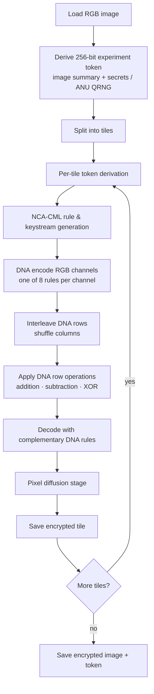

<div align="center">
  <h1>Sphinx</h1>
  <p>An image-encryption experiment built on chaotic maps, NCA-CML keystreams, and DNA-style transforms.</p>

  <p>
    <a href="#overview">Overview</a> •
    <a href="#pipeline">Pipeline</a> •
    <a href="#installation">Installation</a> •
    <a href="#usage">Usage</a> •
    <a href="#testing">Testing</a> •
    <a href="#limitations">Limitations</a>
  </p>

  <p>
    
    
    
  </p>
</div>

---

> [!CAUTION]
> **Sphinx is not a secure cryptography library.** It is an educational prototype and code-rehabilitation exercise. For any real confidentiality or integrity requirement, use standard authenticated encryption such as AES-GCM or ChaCha20-Poly1305. This scheme has not been formally analyzed or security-proven.

## Overview

Sphinx is a research-inspired image cipher for studying how design choices affect diffusion, damage locality, and failure modes in custom encryption schemes. It uses:

- **SHA-256-derived one-time tokens** seeded from an image summary vector plus either local randomness (`secrets`) or an optional quantum source (ANU QRNG API).
- **An NCA-CML-inspired keystream generator** for deterministic rule selectors, row/column operations, and per-pixel keystreams.
- **DNA-style encoding and operations** — one of eight encoding rules per channel, followed by DNA addition, subtraction, or XOR.

The current version is a portfolio cleanup of an earlier prototype, focused on reproducibility, cleaner interfaces, and more honest claims about what the code actually does.

## Pipeline



Decryption runs the same pipeline in reverse, tile by tile.

## Why Tile-Based Processing

The old implementation used a single image-wide permutation. Its failure mode: any localized damage to the ciphertext — a corrupted region, a partial write — was scattered across the entire decrypted image by the inverse permutation.

The current implementation encrypts each tile independently, which means:

- localized ciphertext damage stays localized after decryption,
- damaged regions are easy to visually inspect and isolate,
- the diffusion/locality tradeoff is explicit and configurable via `--tile-size`.

Smaller tiles contain damage more aggressively. `--tile-size 0` runs a single whole-image block, matching the behavior of the old scheme.

## Installation

```bash
python -m pip install -r requirements.txt
```

## Usage

**Encrypt** with the default tile size:

```bash
python encrypt.py images/m6kuvrsdpy551.png --token-file output/token.json
```

**Encrypt** with a smaller tile size for tighter damage containment:

```bash
python encrypt.py images/m6kuvrsdpy551.png --tile-size 32 --token-file output/token.json
```

**Encrypt** with analysis plots:

```bash
python encrypt.py images/m6kuvrsdpy551.png --plot --token-file output/token.json
```

**Decrypt** using the saved metadata file:

```bash
python decrypt.py encrypted_output/<encrypted-file>.png --token-file output/token.json
```

**Decrypt** by passing the token directly:

```bash
python decrypt.py encrypted_output/<encrypted-file>.png --token <64-hex-token> --tile-size 64
```

To use the ANU quantum RNG source, set the `SPHINX_ANU_API_KEY` or `ANU_API_KEY` environment variable before running.

## Project Structure

```
sphinx/
├── encrypt.py                        # CLI entrypoint — encryption
├── decrypt.py                        # CLI entrypoint — decryption
└── functions/
    ├── pipeline.py                   # Deterministic tile-local orchestration
    ├── generateSecureKey.py          # Token derivation and analysis helpers
    ├── ncaCml.py                     # NCA-CML parameter updates, rule selection,
    │                                 # permutations, and keystream generation
    └── matrixDNAManipulator.py       # 8 DNA rules + addition, subtraction, XOR, inverses
```

## Testing

```bash
python -m unittest discover -s tests
```

The test suite covers:

- encrypt/decrypt round-trip correctness,
- DNA encode/decode round-trip,
- RGB channel ordering,
- deterministic NCA-CML key-material generation,
- CLI smoke tests,
- localized damage staying within its originating tile.

## Limitations

- The algorithm is custom and provides no formal security guarantees. Do not use it to protect sensitive data.
- Tile-local processing improves resilience to partial data loss at the cost of reduced global diffusion relative to a whole-image permutation.
- The implementation is inspired by chaos-based image-encryption literature (see [Reference](#reference)), but is a pragmatic reconstruction, not a claim of exact scientific reproduction.
- The ANU QRNG path is optional and requires an API key.

## Reference

Inspired by chaos-based image-encryption literature, including:

> Hua, Z. et al. (2018). *2D Sine Logistic modulation map for image encryption.* Information Sciences. [doi:10.1016/j.ins.2018.04.013](https://www.sciencedirect.com/science/article/abs/pii/S0165168418300859)
